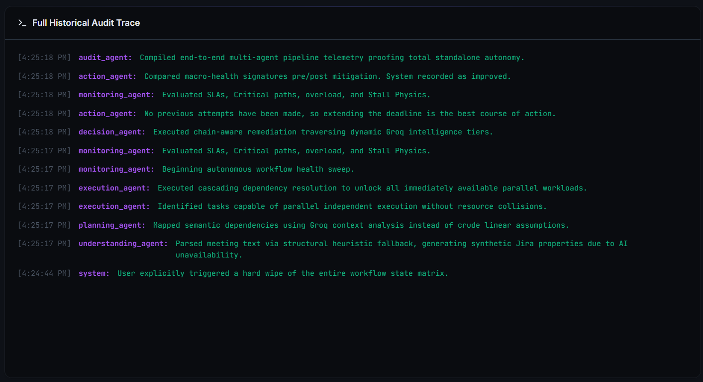
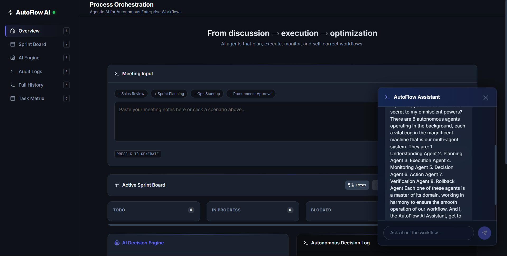

## AutoFlow AI — Agentic AI for Autonomous Enterprise Workflows

AutoFlow AI converts raw meeting notes into an executable enterprise workflow end-to-end. It extracts tasks, plans dependencies, executes with SLA-based monitoring, self-corrects via tiered remediation (including Chaos Engineering), and records every decision in an audit trail.

See the Architecture diagram below for the full data flow and error-handling logic.

## Problem Statement Alignment (Ownership + Self-Correction + Auditability)

AutoFlow AI is a demo-safe, multi-agent system designed to take ownership of complex, multi-step enterprise processes end-to-end. It turns raw meeting notes into an executable workflow, continuously detects failures and process drift (delays, stalls, blocked steps, missing owners, and imminent SLA risks), and self-corrects using tiered remediation. The system is built for minimal human involvement while keeping a fully auditable trail of every decision it makes.

## What We Built (Required Capabilities)

- Process orchestration agents that manage business workflows like procurement lifecycles and operational delivery using an internal task dependency graph and state transitions.
- Meeting intelligence systems that extract decisions and tasks, infer or assign owners, track completion state, and resolve stalls without manual follow-up.
- Multi-agent collaboration setups where specialized steps (understanding, planning, execution, monitoring, decisioning, action, verification, rollback) work together to complete the process.
- Workflow health monitors that catch process drift and predict bottlenecks early, then reroute/escalate before SLA breaches become critical.

## Depth of Autonomy (Minimal Human Involvement)

After a workflow is generated, the engine runs a monitoring/remediation loop and applies fixes autonomously:

- Tier 0: extend deadlines to buy time for clarification.
- Tier 1: reassign to a better-fit owner to keep the workflow moving.
- Tier 2: split failing tasks into parallelizable subtasks (true workflow restructuring).
- Tier 3: hard escalation when repeated mitigation attempts fail.

If health degrades after a remediation attempt, the system verifies and rolls back to a pre-mutation snapshot to prevent “bad fixes”.

## Auditability (Every Decision Logged)

All agent actions are recorded in an immutable audit trail:

- Backend endpoint `GET /logs` returns the provenance log.
- Each task stores an `audit_trail` showing what happened and why.
- The verification/rollback path also records when and why a rollback occurred.

This gives you complete traceability for every decision the swarm makes during SLA risk mitigation.

## Public Repo

- GitHub: [0nandeesh/Economic_times_hackthon-Agentic-AI-for-Autonomous-Enterprise-Workflows](https://github.com/0nandeesh/Economic_times_hackthon-Agentic-AI-for-Autonomous-Enterprise-Workflows.git)


## Architecture Overview (Diagram + Error Handling)

### 1. System Diagram

```text
User/UI
  │  (raw meeting notes)
  │  POST /process-meeting
  ▼
FastAPI Backend
  ├─ understanding_agent()
  │    ├─ Groq (if available) extracts structured tasks
  │    └─ deterministic fallback (bullet parsing)
  ├─ planning_agent()
  │    └─ dependencies + critical path flags
  ├─ execution_agent()
  │    └─ moves pending → in_progress when dependencies allow
  └─ monitoring_cycle()
       ├─ monitoring_agent()
       │    └─ detects delayed/blocked/missing-owner/stalls/overload
       ├─ decision_agent()
       │    └─ remediation actions (Groq + deterministic fallback)
       ├─ action_agent()
       │    └─ applies owner/status/deadline mutations (+ spawns mitigation)
       └─ verification_agent() + rollback_agent()
            └─ if health worsens, restore snapshot + record audit

Frontend
  ├─ GET /workflow (renders Sprint Board + Task Matrix)
  └─ GET /logs (renders provenance audit trail)
```

### 2. Component Diagram (Logical)

```text
             ┌───────────────────┐
             │   React Frontend  │
             │  - Meeting Input  │
             │  - Tasks View     │
             │  - Health Chip    │
             │  - Audit Log      │
             └────────┬──────────┘
                      │ HTTP (JSON)
                      ▼
           ┌────────────────────────┐
           │     FastAPI Backend    │
           │  (main app + router)   │
           └────────┬───────────────┘
                    │
         ┌──────────┼───────────────────────────────┐
         ▼          ▼                               ▼
 ┌────────────┐┌──────────────┐             ┌────────────────┐
 │ routes/    ││ core/        │             │ services/      │
 │ workflow_  ││ - store      │             │ - GroqService  │
 │ routes.py  ││ - state      │             └────────────────┘
 └─────┬──────┘│ - monitor    │
       │       │ - executor   │
       │       │ - orchestrator
       │       │
       │       │
       │       └──────────────┘
       │                ▲
       ▼                │
 ┌─────────────────────────────┐
 │ agents/                     │
 │ - understanding_agent.py    │
 │ - planning_agent.py         │
 │ - decision_agent.py         │
 │ (monitoring/execution live  │
 │  in core for simplicity)    │
 └─────────────────────────────┘
```

#### UI Screenshots (from `images/`)

**1) Agentic task classification + monitoring**


This screenshot shows the end-to-end flow: meeting input, the generated Sprint Board columns (`TODO`, `IN PROGRESS`, `BLOCKED`, `DONE`), and how tasks get classified and tracked automatically by the monitoring loop.

**2) Full historical audit trace**



This is the provenance trail that records what each agent did (planning, execution, monitoring, decision, action). It demonstrates auditability: every remediation decision is logged with reasoning.

**3) Chat assistant (explain/verify workflow)**



The built-in assistant can answer about the workflow, explain decisions, and reference what happened in the background. It reinforces minimal human involvement by reducing follow-up questions.

**4) Landing / meeting input experience**


This is the primary entry screen: users paste meeting notes, choose scenario chips, and trigger workflow generation. It’s designed to support the demo narrative from discussion to execution and optimization.

**5) Task assignment via agent-generated matrix**


This screenshot shows the Sprint Board/Task Matrix view with structured fields (status, epic, task name, priority, deadline, and assignee). It confirms owner assignment and scheduling logic used by the orchestration engine.

### 3. Agent Roles (What each step does)

- `understanding_agent()` converts meeting notes into structured `tasks` (title, owner, priority, intent, etc.).
- `planning_agent()` builds logical dependencies and marks critical-path tasks.
- `execution_agent()` starts tasks when all prerequisites are `done` (or startable by rules).
- `monitoring_agent()` scans the live workflow and produces `issues` (delayed, missing-owner, blocked, stalled, overload).
- `decision_agent()` turns issues into remediation actions (reassign/extend/split/escalate). It uses Groq when available but always keeps deterministic fallback logic.
- `action_agent()` applies decisions to the in-memory workflow state and appends audit entries.
- `verification_agent()` ensures the system did not make health worse; if it did, `rollback_agent()` restores a pre-change snapshot.

### 4. Tool Integrations

- Groq LLM integration: used for structured extraction, dependency analysis, and remediation recommendations.
- FastAPI endpoints:
  - `POST /process-meeting`: run the full pipeline once for new meeting text.
  - `GET /workflow`: return the current in-memory workflow state (tasks + sprint data).
  - `POST /simulate-delay` and `POST /inject-exception`: trigger demo edge cases.
  - `GET /logs`: return the immutable audit log.
- Frontend: the Sprint Board and Task Matrix are rendered from `/workflow`; audit trail from `/logs`.

### 5. Error Handling Logic (Demo-safe)

- LLM unavailable/misconfigured: automatically falls back to deterministic parsing and rule-based remediation.
- Incomplete/bad LLM output:
  - For bullet-list inputs, extraction is kept deterministic (to avoid Groq truncation).
  - If Groq returns a different number of extracted tasks than the detected bullet lines, the system falls back to heuristic parsing and records `bullet_count_mismatch` in the audit log.
  - If Groq JSON parsing fails, exceptions are caught and the cycle uses fallback logic.
- Missing owner handling:
  - Monitoring flags tasks with empty `owner`.
  - Decision forces reassignment for missing owners and infers common sprint roles from task title keywords:
    - testing/QA/quality → `Testing`
    - design/creative/UI/UX → `Design Team`
    - deploy/deployment/release/ship → `Deployment`
    - marketing/campaign/ads → `Marketing`
  - Action agent sanitizes invalid `recommended_owner` values so the UI never shows “No team member …”.
- Safety rollback:
  - After actions, verification checks health before vs. after.
  - If health degrades, rollback restores the snapshot and logs the rollback event.

## Workflow Health Monitoring (Drift + Bottleneck Prediction)

The `monitoring_agent` scans the live workflow state and flags issues that indicate process drift or impending SLA failure:

- Delayed tasks (deadline passed) are marked as `delayed`.
- Tasks with missing owners are flagged as `missing_owner_tasks` so the system can reassign automatically.
- Stalls are detected from lack of status updates.
- Overload detection and critical-path sensitivity drive a quantitative `health_score`.

Those issues then feed the `decision_agent`, which chooses the next self-correction action (Groq-assisted when available, deterministic fallback otherwise) so remediation happens before risk becomes a hard breach.

## Impact Model (Quantified Business Estimate)

Assumptions (conservative, adjustable):
- Team size per workflow: 8 people.
- Recurring workflows: 10 per team.
- Meeting cadence: 1 meeting/week/project.
- Avg manual post-meeting ops (current state):
  - Task extraction/cleaning: 20 minutes
  - Owner assignment/clarifications: 15 minutes
  - Chasing delays/follow-ups: 45 minutes/week
  - Total: 80 minutes/week/project

Time saved per workflow (with AutoFlow AI):
- Extraction/structuring: 20 → 2 minutes (save 18 minutes)
- Owner assignment: 15 → 5 minutes (save 10 minutes)
- Chasing delays: 45 → 20 minutes (save 25 minutes)
- Total saved per project/week: 18 + 10 + 25 = ~53 minutes (~0.9 hours)

Cost savings:
- Using $70/hour fully-loaded cost:
  - Weekly savings per team: 10 projects × 0.9h × $70 ≈ $630/week
  - Annual savings per team: ≈ $32,760/year
- For 20 teams: ≈ $655,200/year

Revenue / penalty impact (missed deadlines prevented):
- If 2 projects/year per team are materially impacted and at-risk value per project is $100,000:
  - At-risk value/year per team = 2 × $100,000 = $200,000
  - Additional value protected (conservative uplift): 20% → $40,000/year per team
- Across 20 teams: ≈ $800,000/year protected

Total estimated annual impact (20 teams):
- Time/cost savings: ~$655,200/year
- Revenue/penalty protected: ~$800,000/year
- Combined: ~$1.45M/year (even with 50% error tolerance: ~$700k+/year)

### Backend (FastAPI / Groq)

### Setup / Run

From the repository root:

```bash
pip install -r backend/requirements.txt

cd backend
python -m uvicorn main:app --reload --port 8000
```

The backend exposes:
- **POST** `/process-meeting` – Meeting Intelligence input.
- **GET** `/workflow` – Access to in-memory workflow SLA physics.
- **POST** `/inject-exception` – Evaluates depth of autonomy by forcing extreme organizational blockers on tasks dynamically, testing if the swarm can build new ones natively. 
- **POST** `/simulate-delay` – Validates standard auto-reassignment protocols via simulated load delays.
- **GET** `/logs` – Immutable Provenance Audit API.

### Frontend (React + HTML5 + CSS)

No build step required. Extremely lightweight and fast rendering.

1. Open `frontend/index.html` directly in your browser, or serve `frontend/` with any static server (e.g., `python -m http.server 3000`).
2. Ensure `API_BASE` in `frontend/app.js` points to the backend (default: `http://127.0.0.1:8000`).

### System Demo & Features Walkthrough
1. **Meeting Intelligence (Generative parsing):** Click the "Procurement Approval" scenario chip or paste text. Hit Generate.
2. **Process Orchestration:** Switch to the Sprint Board. The matrix was built dynamically. 
3. **Chaos Engineering & Resilience Run:** Press `C` on your keyboard or click "Inject Chaos". The Monitoring agent will detect a critical external failure, automatically archive the affected assignment, and spawn a brand-new mitigation issue directly. 
4. **Hybrid Manual Controls:** Click any Kanban card. A sleek frosted-glass drawer spawns exposing that task's precise LLM generation metrics. Try dragging its status forcing a human manual override!
5. **Real-Time Data Matrix:** Press `6` or check "Task Matrix" to pivot out of the Sprint Board and into a precise SLA-driven data table built exclusively to verify assignment depths natively.

## Commit History (Build Process)

This is a public GitHub repository; the build and documentation updates are reflected in the commit history.

Tip: open the repo page and go to the `History` / `Commits` tab.

Current tip commit:

- `d7afd24` (initial commit)

